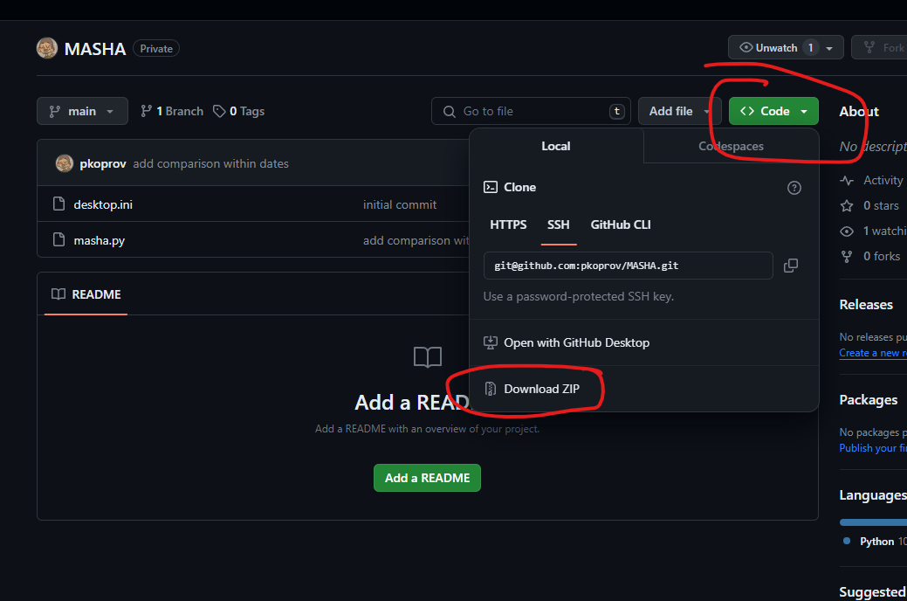
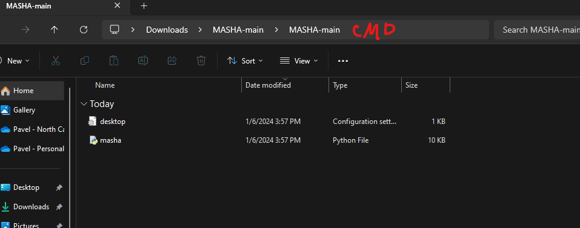
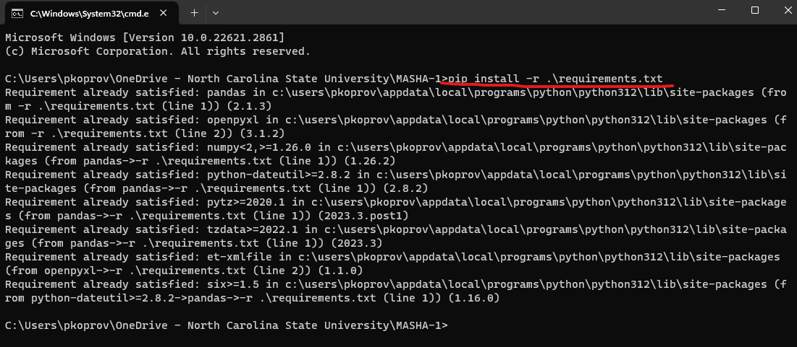
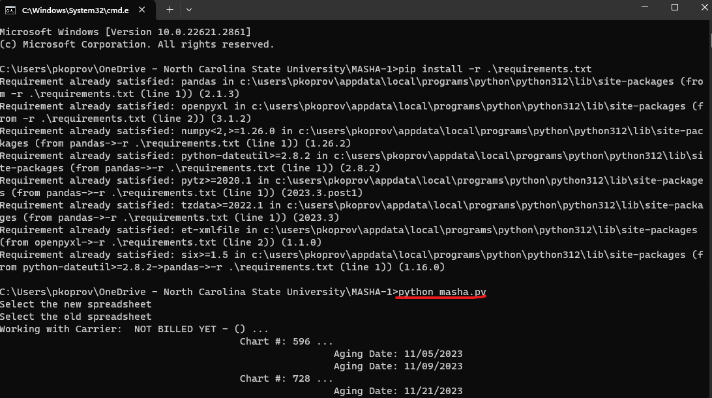

1. Download the zip arhcive and unzip it somewhere

2. Open the folder and type 'cmd' in browser line

3. type `pip install -r .\requirements.txt`

4. Type `python masha.py`, wait until it finishes, and voi la. The updated spreadsheet appers in the folder

